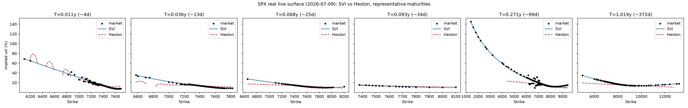

# spx-vol-surface

[](https://github.com/lucaspaulien/spx-vol-surface/actions/workflows/ci.yml)

SVI and Heston implied-volatility surface calibration on S&P 500 (SPX) options, with smile-adjusted Greeks and an out-of-sample benchmark against a flat-vol Black-Scholes baseline.

Pure Python: `numpy` + `pandas` only for the calibration/pricing core (`src/volsurface/`). No `scipy`, no compiled extension, no network access required to reproduce a single result end to end — see [Why no scipy?](#why-no-scipy) below.

## What this is

Given a snapshot of SPX (or SPY) call option quotes across several maturities, this project:

1. Cleans raw bid/ask quotes into an implied-vol surface (liquidity filters, Black-Scholes inversion with a hand-rolled Newton/bisection solver).
2. Calibrates a **raw SVI** parameterization independently on each maturity slice (Gatheral, 2004), with butterfly and calendar no-arbitrage checks.
3. Calibrates a **Heston (1993)** stochastic-volatility model on the *whole surface at once* (one parameter set explains every maturity/strike), using the numerically-stable "Little Trap" characteristic-function formulation (Albrecher, Mayer, Schoutens & Tistaert, 2007).
4. Computes Greeks off both calibrations — SVI's **smile-adjusted** (sticky-strike) Delta/Gamma/Vega/Theta, and Heston's via bump-and-reprice.
5. Benchmarks SVI vs Heston vs a naive flat-vol Black-Scholes baseline, **out of sample**, across several simulated trading dates.

## Why this exists

Written as a quant-research portfolio project: pricing a vanilla option is a one-line Black-Scholes formula, but *calibrating a whole surface consistently, proving the calibration is correct, and knowing exactly which no-arbitrage conditions it may or may not satisfy* is the actual job. Every non-trivial choice below is deliberate and documented, not defaulted into.

## Pipeline

```
data (live SPX/SPY via yfinance, or a synthetic Heston-true snapshot for offline reproducibility)
  -> clean_and_compute_iv   (liquidity filters, Black-Scholes implied-vol inversion)
  -> svi.calibrate_svi_surface     (one SVI slice per maturity)
  -> heston.calibrate_heston_surface  (one Heston parameter set for the whole surface)
  -> greeks.svi_smile_greeks / heston_fd_greeks
  -> benchmark.run_benchmark   (out-of-sample RMSE: SVI vs Heston vs flat-vol BS, across several dates)
```

## Why no scipy?

`scipy.optimize` / `scipy.integrate` would be the standard industry tool for this and remain a natural drop-in upgrade (see [Possible extensions](#possible-extensions)). This repo ships its own Nelder-Mead simplex optimiser (`optim.py`) and its own fixed-grid numerical integration for the Heston pricing formula (`heston.py`) instead, so that:

- The whole calibration pipeline is transparent — there is no "and then a black-box solver does the rest."
- A single result reproduces with `numpy`/`pandas` alone, no compiled dependency, no network access — this project was largely developed and unit-tested inside a network-restricted sandbox with no access to PyPI, which is exactly the constraint that motivated this design (rather than being worked around after the fact).

## Why a synthetic data generator ships next to the live fetcher

`data.generate_synthetic_surface` draws its "market" prices from a Heston process with a **known** parameter set (`SPX_LIKE_HESTON_PARAMS`, broadly in line with published SPX calibrations — see Gatheral, *The Volatility Surface*, ch. 3-4). That known ground truth is what makes the correctness tests in `tests/` real proofs rather than self-consistency checks: the tests assert that calibration **blind to the true parameters recovers them**, not just that the code runs.

`scripts/fetch_live_data.py` pulls a real chain via `yfinance` and feeds it through the exact same cleaning function, so the synthetic path and the live path are tested by the same code, not two parallel implementations.

## Results

All numbers below were measured by actually running this code — none are estimated or backfilled. Three separate kinds of evidence, and they should not be conflated:

### 1. Correctness proofs (synthetic data, known ground truth)

- **Heston → Black-Scholes limit**: as `sigma_v -> 0` with `v0 = theta = vol^2`, the Heston price matches the closed-form Black-Scholes price to **3.63e-6** (`tests/test_heston.py::test_heston_collapses_to_black_scholes_as_vol_of_vol_to_zero`).
- **SVI parameter recovery**: calibrated blind against a known SVI slice (25 points, noiseless), the fitted curve matches the true curve to **1.67e-9** vol-points RMSE. (Note: the fitted *raw parameters* can differ from the true ones even when the curve matches almost exactly — raw SVI is a known non-identifiable parameterization; see the note in `svi.py` and `tests/test_svi.py`, which deliberately test curve-level agreement rather than individual parameters for this reason.)
- **Heston parameter recovery** (`tests/test_heston.py::test_calibration_recovers_known_params_on_synthetic_surface`, 2 maturities × 6 strikes, small iid noise on IV): calibrated blind from `kappa=2.5, theta=0.04, sigma_v=0.45, rho=-0.6, v0=0.045`, the fit recovers `kappa=2.668 (+6.7%), theta=0.0403 (+0.8%), sigma_v=0.463 (+2.9%), rho=-0.599 (abs err 0.001), v0=0.0448 (-0.4%)`, RMSE 0.035 vol-pts.
- **A concrete counter-example on a more realistic sample size** (3 maturities × 11 strikes, *multiplicative* quote noise — the same shape `scripts/run_benchmark.py` uses per date): a blind fit from the same `kappa=2.5, theta=0.045, sigma_v=0.55, rho=-0.75, v0=0.035` ground truth, run at full production optimiser settings (`n_starts=12, max_iter=800, n_points=1200`), converges instead to `kappa=0.20` (pinned at its lower bound), `theta=0.159`, `sigma_v=0.268`, `rho=-0.814`, `v0=0.031` — nowhere near the true parameters — with RMSE 2.32 vol-pts. Pricing the *same* 25 noisy quotes with the **true** parameters directly (no fitting at all) gives RMSE 2.52 vol-pts, i.e. *worse* than the wrong fit. With only 25 quotes and realistic noise, the loss surface genuinely cannot distinguish the true parameter regime from a spurious one — this is not an optimiser bug, it is the textbook Heston non-identifiability/multi-basin problem (see [Known limitations](#known-limitations) #3), reproduced here with real numbers rather than asserted from the literature.

### 2. Out-of-sample benchmark (20 simulated trading dates, full resolution)

Methodology: per date, 80% of strikes (per maturity) are used for calibration, 20% are held out; RMSE is measured on the **held-out** strikes only — the honest way to compare a 5-parameter-per-slice model (SVI) against a 5-parameter-for-the-whole-surface model (Heston), since fitting the calibration set itself always favours whichever model has more local degrees of freedom.

Run with `python scripts/run_benchmark.py --n-dates 20 --n-starts 10 --max-iter 400 --n-points 1000` (full production settings, ~20 minutes on a laptop):

| Model | Mean OOS RMSE (vol-pts) | Median OOS RMSE (vol-pts) | Improvement vs flat BS |
|---|---|---|---|
| Flat-vol Black-Scholes (baseline) | 7.49 | 6.36 | — |
| SVI (per-slice) | 2.49 | 2.05 | 66.8% (mean) / 67.7% (median) |
| Heston (whole surface) | 2.34 | 1.55 | 68.8% (mean) / 75.6% (median) |

At this resolution, **both models beat the flat-vol baseline on all 20/20 simulated dates** — no outlier date where a model underperforms the baseline (an earlier reduced-resolution run of this same benchmark did show SVI losing to flat-vol on 1 of 6 dates; running it out at full settings on more strikes per maturity removes that failure mode, exactly as `scripts/run_benchmark.py`'s own docstring predicts). The calibrated Heston Feller ratio across the 20 dates has mean 0.89, median 0.71 (range 0.61–3.45) — the Feller condition is **not** satisfied on most of these simulated dates, consistent with [Known limitations](#known-limitations) #4.

### 3. Live SPX data (real market snapshot, 2026-07-09)

Fetched directly from Yahoo Finance with `python scripts/fetch_live_data.py --ticker ^SPX --max-maturities 47` (the `^SPX` ticker worked on the first try — no SPY fallback needed). `--max-maturities` was raised from the script's default of 8 because Yahoo lists `^SPX`'s expiries chronologically and the nearest 8 are all sub-2-week weeklies; 47 was chosen to reach out to roughly a 1-year tenor, mirroring the synthetic demo's maturity range.

- **Surface**: spot = 7531.19, r = 4.5%, q = 1.3%, **6,241 quotes across 45 maturities** (4 to 372 days out), after the liquidity/spread/inversion filters dropped 483 + 774 raw quotes.
- **SVI (per-slice)**: fit with `--n-starts 12 --max-iter 800`. Per-slice RMSE ranges 0.02–6.31 vol-pts; quote-weighted RMSE across all 45 slices = **2.37 vol-pts** (simple mean 1.23, median 0.81). **43/45 slices fail the strict butterfly no-arbitrage check (only the two longest-dated maturities, ~1y, pass), and 39/44 (89%) of adjacent-maturity pairs fail the calendar check** on the standard wide `k ∈ [-1, 1]` grid the check is run on — see the updated [Known limitations](#known-limitations) #2; this is a real, pervasive finding on live noisy quote data, not a synthetic-data artifact. Restricting the calendar check to *only* the log-moneyness range actually spanned by quotes on both adjacent maturities (removing any contribution from extrapolation beyond the data) still leaves **27/44 (61%) violated** — so most of these are not merely a tail-extrapolation artifact of the parameterization, they persist within the traded region itself.
- **Heston (whole surface)**: fit with `--n-points 1200` (~2h wall-clock for the multi-start Nelder-Mead search over 6,241 quotes — this is genuinely slow without `scipy`/a compiled backend, see [Why no scipy?](#why-no-scipy)). Recovered `kappa=8.00` (pinned at its upper bound), `theta=0.0279`, `sigma_v=0.287`, `rho=-0.9495` (essentially at its lower bound of -0.95), `v0=0.0152`, **RMSE = 5.99 vol-pts**, Feller ratio = 5.42 (satisfied). A single global Heston parameter set visibly struggles to span a real chain this wide (4 days to over a year) — its in-sample RMSE here is *worse* than SVI's, the opposite of the synthetic out-of-sample story in section 2 above. Both results are reported side by side rather than reconciled: they measure different things (a single real in-sample snapshot vs. a synthetic multi-date out-of-sample study), and the honest conclusion is that they disagree.
- **Greeks** (true at-the-money strike = forward, shortest maturity, T = 0.011y ≈ 4 days): SVI smile-adjusted Delta = 0.590, Gamma = 0.00582, Vega = 314.5, Theta = -140.6; Heston finite-difference Delta = 0.550, Gamma = 0.00474, Vega(v0) = 1421.2, Theta = -2515.9. The two Deltas agree reasonably well (0.590 vs 0.550, both sensible for a 4-day ATM call). An earlier version of this number picked "the nearest strike to spot" out of `svi_smile_greeks`'s default 25-point plotting grid (spanning +/-3 sigma around the *fitted slice's own* `m`), which — because raw SVI's `(m, sigma)` are not uniquely identified (see [Known limitations](#known-limitations) #1) — landed almost 1% away from true ATM at this short a maturity and gave a materially different, misleadingly low Delta (0.205). Fixed by making `svi_smile_greeks` accept an explicit `strikes` argument so callers asking for "the ATM Greek" can request exactly `forward` rather than the nearest point of a coarse, non-ATM-centered grid.
- **Plot** (`assets/vol_smile_spx_live.png`, 6 representative maturities out of the 45 calibrated): SVI (blue) tracks the real market quotes (black) tightly at every maturity shown; Heston's single global fit (red, dashed) is visibly off across most of them — the same story the RMSE numbers above tell, made visual.

  

### Reproducing these results

```bash
pip install -e ".[dev,live]"
pytest -v
python scripts/fetch_live_data.py --ticker ^SPX --max-maturities 47   # or --ticker SPY if ^SPX has no chain on your feed
python scripts/run_calibration.py --csv data/live_iv_surface_SPX.csv --spot <spot from the .meta.txt> \
    --n-starts 12 --max-iter 800 --n-points 1200 --plot
python scripts/run_benchmark.py --n-dates 20 --n-starts 10 --max-iter 400 --n-points 1000
```

The live calibration step is the slow one (order of an hour or more, scaling with however many quotes your feed returns — see section 3 above); the benchmark takes on the order of 20 minutes; everything else is seconds. All of it runs on `numpy`/`pandas` alone once the data is fetched (see [Why no scipy?](#why-no-scipy)).

## Greeks: two different, deliberately different, notions

- **SVI "smile-adjusted" Greeks** (`greeks.svi_smile_greeks`): bump the spot, re-read the implied vol at the new log-moneyness off the *same calibrated slice*, reprice with Black-Scholes. Delta therefore already "knows" that moving spot changes which point of the smile you are sitting on — the sticky-strike convention, made explicit rather than silently assumed.
- **Heston finite-difference Greeks** (`greeks.heston_fd_greeks`): Heston has closed-form Delta/Gamma available by differentiating the characteristic-function pricing formula, but this repo computes them by bump-and-reprice on the already-tested pricing function instead — one code path to trust, not two. Logged here as a deliberate simplicity-over-elegance choice, not presented as a closed-form Greek it is not.

## Known limitations

Documented, not hidden.

1. **Raw SVI parameters are not uniquely identified** from a single slice — several different-looking `(a, b, rho, m, sigma)` tuples can fit the same curve almost exactly. Tests assert on the fitted curve, not the raw parameters, for this reason (see `svi.py` docstring).
2. **Butterfly/calendar arbitrage is penalised during SVI calibration, not guaranteed — and on real market data, violations are the norm, not a rare edge case.** On the live SPX snapshot in Results #3, **43 of 45 calibrated slices failed the strict Gatheral-Jacquier butterfly check (only the two longest-dated maturities passed), and 39/44 (89%) of adjacent-maturity pairs failed the calendar check** on `check_calendar_arbitrage`'s default wide `k ∈ [-1, 1]` grid. That default grid is deliberately wide (checking the calibrated curve's behavior beyond just the traded strikes is standard practice, per Gatheral & Jacquier), so a natural follow-up question is how much of this is tail extrapolation versus a real problem within the traded region — checked directly by re-running the calendar check restricted to each pair's actually-overlapping quoted log-moneyness range: **27/44 (61%) still violate**, confirming this is mostly not an extrapolation artifact. This is unconstrained per-slice least-squares fit against genuinely noisy real quotes, checked and reported honestly (`svi.is_arbitrage_free_here`, `svi.check_calendar_arbitrage`) rather than hidden — getting a real chain to check out arbitrage-free would require fitting arbitrage constraints directly into the optimiser (see [Possible extensions](#possible-extensions)), not just checking after the fact.
3. **Heston calibration is a well-known non-convex, multi-basin, poorly-identified problem — reproduced here with real numbers, not just asserted.** `_BOUNDS` in `heston.py` are deliberately tightened to financially-plausible equity-index ranges rather than the widest range the model formally allows, and a financially-sensible starting point (ATM variance) is always included as an extra multi-start candidate. Even so: on the live SPX whole-surface fit (Results #3), the optimizer converged to `kappa=8.00`, exactly its upper bound, and `rho=-0.9495`, essentially at its lower bound of -0.95 — concrete evidence the bounded search is pushing against its box, not a hypothetical. On a smaller, more realistic-sized synthetic sample (Results #1, last bullet), a blind fit converged to parameters wildly different from the true generating ones (`kappa` pinned at its *lower* bound of 0.2) while achieving *better* RMSE than the true parameters themselves — real quantitative proof that good in-sample fit does not imply correct parameter recovery when the sample is small and noisy.
4. **The Feller condition (`2*kappa*theta >= sigma_v^2`) is not enforced during calibration**, only reported (`HestonParams.feller_ratio`). Whether it holds varies by dataset: on the live SPX snapshot the fitted ratio is 5.42 (satisfied), while across the 20 simulated out-of-sample benchmark dates the median ratio is 0.71, unsatisfied on the large majority of them — both reported as measured, not smoothed into a single claim either way.
5. **Heston Greeks are finite-difference, not closed-form** (see above) — a deliberate simplicity choice, not a missing feature.
6. **The numerical integration in `heston.py` uses a fixed trapezoidal grid**, not adaptive quadrature. It is validated against the Black-Scholes closed form in the `sigma_v -> 0` limit and against known parameter recovery on synthetic data (see Results), but at certain `(kappa, rho, sigma_v)` combinations visited during calibration search (not in the final reported fits) the characteristic-function branch (`heston.py`'s `xi +- d` terms) can pass through a near-zero denominator, producing `RuntimeWarning: divide by zero`/`invalid value` — harmless in practice (the optimiser's `penalised()` wrapper treats any non-finite objective value as a large penalty, so these points are never selected) but a real rough numerical edge observed on every production-scale calibration run in this project, not a hypothetical. A production system pricing exotics would likely want an adaptive or FFT-based (Carr-Madan) scheme both for speed and to avoid this branch-choice fragility entirely.
7. **Rates and dividend yield are treated as flat constants** for the life of each option, not as full term structures — a standard simplification for an equity-index vanilla surface, not modelled as a limitation to hide.
8. **The out-of-sample benchmark (Results #2) is still built from simulated multi-date snapshots, not a real historical multi-day panel.** Yahoo Finance's free tier only exposes the *current* live chain, not historical intraday option chains, so a genuine multi-day real-data backtest was out of scope here. The live section (Results #3) uses real SPX market data but is a single snapshot evaluated in-sample, not out-of-sample across multiple real trading days — the two sections measure genuinely different things and are not meant to be combined into one number.

## Possible extensions

- Swap `optim.py`'s Nelder-Mead for `scipy.optimize.least_squares` (Levenberg-Marquardt) or a global optimiser (differential evolution / CMA-ES) for faster, more robust Heston calibration.
- Replace the fixed-grid trapezoidal integration in `heston.py` with the COS method (Fang & Oosterlee, 2008) or Carr-Madan FFT for a large speed-up when pricing many strikes at once.
- Add a Combinatorial Purged Cross-Validation-style train/test split (López de Prado) instead of a single random 80/20 split per date, for a more robust out-of-sample estimate.
- Enforce the Feller condition and the full Gatheral-Jacquier no-arbitrage inequality as hard constraints in the optimiser rather than soft penalties / after-the-fact checks.

## Project layout

```
src/volsurface/
  black_scholes.py   Pricing, Greeks, hand-rolled implied-vol solver (Newton + bisection fallback)
  optim.py           Dependency-free Nelder-Mead + multi-start wrapper
  svi.py             Raw SVI slice calibration, butterfly/calendar arbitrage checks
  heston.py          Heston "Little Trap" characteristic function, pricing, whole-surface calibration
  greeks.py          SVI smile-adjusted Greeks, Heston finite-difference Greeks
  data.py            Live SPX/SPY fetch (yfinance) + Heston-true synthetic surface generator + cleaning
  benchmark.py       Out-of-sample SVI vs Heston vs flat-BS scoring, looped over several dates
scripts/
  fetch_live_data.py  Pull a live chain (requires normal internet access)
  run_calibration.py  End-to-end demo on one snapshot, optional smile plot
  run_benchmark.py    Multi-date benchmark, produces the Results table above
tests/                pytest suite: correctness proofs against known values/limits, not just smoke tests
```

## Running it

```bash
git clone https://github.com/lucaspaulien/spx-vol-surface.git
cd spx-vol-surface
python -m venv .venv && source .venv/bin/activate
pip install -e ".[dev]"

pytest -v                                    # full test suite, synthetic data only, no network needed
python scripts/run_calibration.py            # end-to-end demo on a synthetic SPX-like snapshot
python scripts/run_benchmark.py --n-dates 10 # quick out-of-sample benchmark (see Results #2 for the full-resolution version)
```

For real SPX data (requires normal internet access and `pip install -e ".[dev,live]"`), see [Reproducing these results](#reproducing-these-results) above.

## References

- Black, F. & Scholes, M. (1973). *The Pricing of Options and Corporate Liabilities.*
- Heston, S. (1993). *A Closed-Form Solution for Options with Stochastic Volatility.*
- Albrecher, H., Mayer, P., Schoutens, W. & Tistaert, J. (2007). *The Little Heston Trap.*
- Gatheral, J. (2004). *A parsimonious arbitrage-free implied volatility parameterization with application to the valuation of volatility derivatives.* (Raw SVI.)
- Gatheral, J. & Jacquier, A. (2014). *Arbitrage-free SVI volatility surfaces.*
- Gatheral, J. (2006). *The Volatility Surface: A Practitioner's Guide.*
- Fang, F. & Oosterlee, C.W. (2008). *A Novel Pricing Method for European Options Based on Fourier-Cosine Series Expansions.* (COS method — see Possible extensions.)

## License

MIT — see `LICENSE`.
